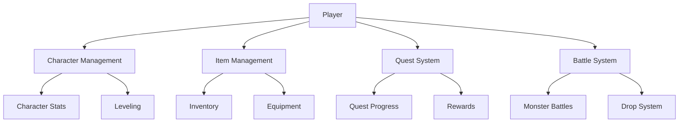

# GameTrek Adventure World

A blockchain-based adventure game where players own characters, items, and progress through immutable on-chain assets. Players can explore worlds, complete quests, battle monsters, and trade items in a decentralized gaming ecosystem.

## Overview

GameTrek Adventure World creates a persistent gaming experience where all game state and ownership is recorded on the Stacks blockchain. Players have true ownership of their in-game assets including:

- Characters with stats and progression
- Items, weapons, and equipment
- Quest completion and achievements
- Battle histories and monster encounters

The game features a rich ecosystem of interactions including:

- Character creation and leveling
- Item equipment and trading
- Quest completion and rewards
- Monster battles with drop mechanics
- Character healing and travel systems

## Architecture

The game is built around a central smart contract that manages all game state and interactions:



The contract uses maps to store:
- Character data and stats
- Item ownership and attributes
- Quest completion status
- Monster information
- Equipment loadouts
- Inventory contents

## Contract Documentation

### Core Game Functions

#### Character Management
- `create-character`: Create a new character with starting stats
- `transfer-character`: Transfer character ownership to another player
- `heal-character`: Restore character health
- `travel`: Move character to a new location

#### Item System  
- `create-item`: Create new game items (admin only)
- `transfer-item`: Transfer item ownership between players
- `equip-item`: Equip items to characters
- `unequip-item`: Remove equipped items

#### Quest System
- `create-quest`: Create new quests (admin only)
- `start-quest`: Begin a quest and receive rewards
- `get-available-quests`: View quests available to a character

#### Battle System
- `battle-monster`: Engage in combat with monsters
- `create-monster`: Create new monsters (admin only)

### Data Maps

- `characters`: Stores character attributes and stats
- `items`: Contains item properties and ownership
- `quests`: Defines available quests and rewards
- `monsters`: Stores monster stats and drop tables
- `character-inventory`: Tracks items owned by characters
- `equipped-items`: Manages currently equipped items
- `completed-quests`: Records finished quests per character

## Getting Started

### Prerequisites
- Clarinet CLI installed
- Stacks wallet for deployment and testing

### Local Development
1. Clone the repository
2. Run `clarinet integrate` to start a local devnet
3. Deploy the contract using `clarinet deploy`

### Basic Usage

Create a character:
```clarity
(contract-call? .gametrek-game create-character "Hero")
```

Equip an item:
```clarity
(contract-call? .gametrek-game equip-item character-id item-id)
```

Start a quest:
```clarity
(contract-call? .gametrek-game start-quest character-id quest-id)
```

Battle a monster:
```clarity
(contract-call? .gametrek-game battle-monster character-id monster-id)
```

## Security Considerations

- All state-changing functions verify ownership
- Level requirements enforce progression gates
- Transfer restrictions on certain items
- Monster battles use simplified RNG (should use VRF in production)
- Health cannot drop below 1 to prevent permanent death states

## Limitations

- Battle system uses deterministic calculations
- Random number generation is not cryptographically secure
- Item creation restricted to contract owner
- Fixed inventory size limits
- Basic quest completion mechanics